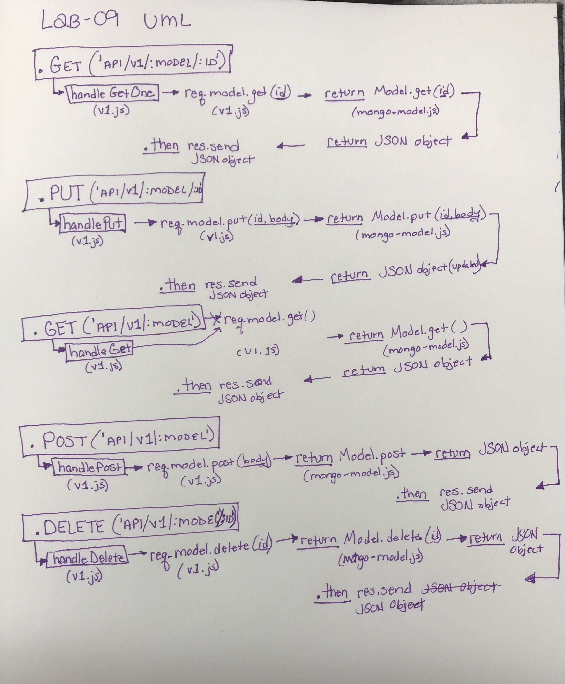
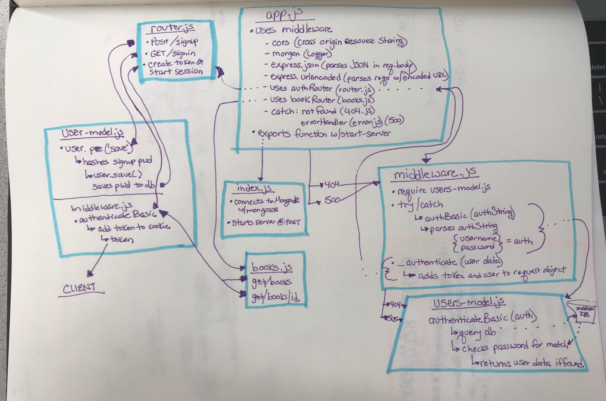

# Build-an-api-server
Build an api server using the two labs from earlier this week

###  Author: Chloie Parsons

## Links and Resources
* [Submission PR](https://github.com/chloieparsons-401-advanced-javascript/build-an-api-server/pull/2)

* [Travis](https://www.travis-ci.com/chloieparsons-401-advanced-javascript/build-an-api-server)
* [Heroku](https://build-an-api-server.herokuapp.com/)


## Setup
* .env requirements

  - ```PORT``` - 3000
  - ```SECRET``` - choose a secret string 
  - ```MONGODB_URI``` - mongodb://localhost:27017/api-auth-server
  - ```TOKEN_EXPIRE``` - 15m

## Running the app
npm start script: node index.js

Endpoint: /role
 - Returns new role added

Endpoint: /oauth
 - Authorization route

Endpoint: //api/v1/:model
 - handleGetAll route
 - handlePost

Endpoint: //api/v1/:model/:id
 - handlePut
 - delete

# Tests
How do you run tests? 
* npm run test-watch

# UML Data Flow
* API Server 

* Auth Server 